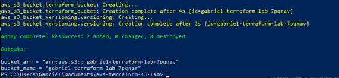

# AWS Terraform S3 Lab

Infrastructure as Code (IaC) project using Terraform and Amazon S3.

---

## 🎯 Objective

This project demonstrates how to provision AWS infrastructure using Terraform by creating an Amazon S3 Bucket with Versioning enabled.

---

## 🏗️ Architecture

```text
Terraform
    │
    ▼
AWS Provider
    │
    ▼
Amazon S3 Bucket
    │
    ▼
Bucket Versioning
```

---

## ☁️ AWS Services Used

- Amazon S3
- AWS IAM
- AWS CLI

---

## 🚀 Terraform Workflow

```bash
terraform init
terraform plan
terraform apply
terraform destroy
```

---

## ✅ Project Results

The infrastructure was successfully:

- Provisioned using Terraform
- Validated in the AWS Management Console
- Destroyed using Terraform

---

# 📸 Screenshots

## Terraform Init


---

## Terraform Plan


---

## Terraform Apply


---

## S3 Bucket Creation



---

## S3 Bucket Created


---

## Bucket Versioning Enabled


---

## Terraform Destroy


---

## 💻 Skills Demonstrated

- Terraform
- Infrastructure as Code (IaC)
- Amazon S3
- Bucket Versioning
- AWS IAM
- AWS CLI
- Cloud Infrastructure Automation

---

## 👨‍💻 Author

**Gabriel Paes Cardenette**

- AWS Certified Cloud Practitioner (CLF-C02)
- Cisco Networking Basics
- Cisco Introduction to Cybersecurity
