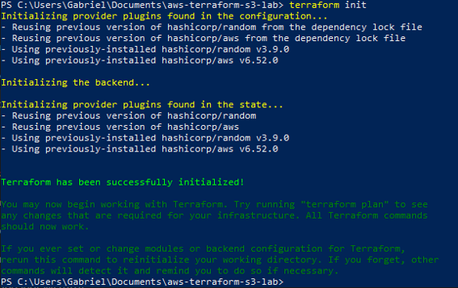
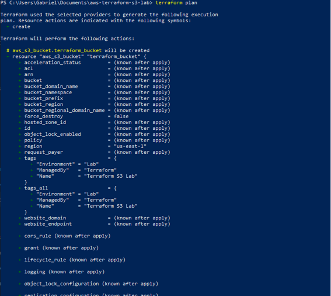
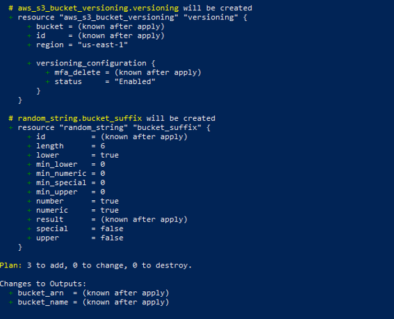
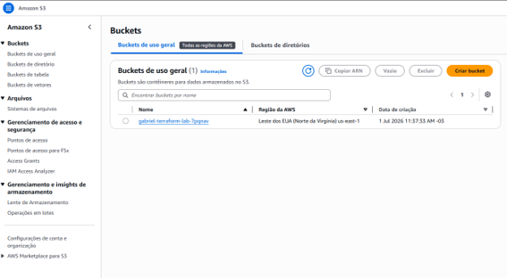
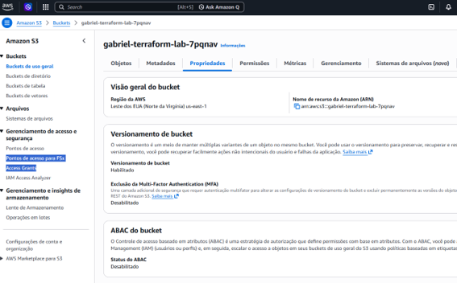
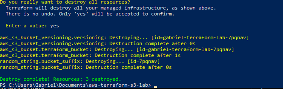

# AWS Terraform S3 Lab

Infrastructure as Code (IaC) project using Terraform and Amazon S3.

---

## Objective

This project demonstrates how to provision AWS infrastructure using Terraform by creating an Amazon S3 Bucket with Versioning enabled.

The infrastructure is fully managed through Terraform, allowing creation and destruction with a few commands.

---

## Architecture

Terraform
↓
AWS Provider
↓
Amazon S3 Bucket
↓
Bucket Versioning

---

## AWS Services Used

- Amazon S3
- AWS IAM
- AWS CLI

---

## Terraform Resources

### Amazon S3 Bucket

- Unique bucket name
- Managed with Terraform
- Tagged for identification

### Bucket Versioning

- Versioning enabled
- Protection against accidental object deletion

---

## Terraform Workflow

### Initialize Terraform

```bash
terraform init
```

### Review Infrastructure

```bash
terraform plan
```

### Create Infrastructure

```bash
terraform apply
```

### Destroy Infrastructure

```bash
terraform destroy
```

---

## Project Results

The project successfully demonstrates:

- Infrastructure as Code (IaC)
- Amazon S3 provisioning
- Bucket Versioning
- AWS CLI authentication
- Terraform State Management

---

## Evidence

### Terraform Initialization



---

### Terraform Plan



---

### Terraform Apply



---

### S3 Bucket Created



---

### Bucket Versioning Enabled



---

### Terraform Destroy



---

## Skills Demonstrated

- Terraform
- Infrastructure as Code
- Amazon S3
- AWS CLI
- IAM
- Versioning
- Cloud Automation

---

## Author

Gabriel Paes Cardenette

### Certifications

- AWS Certified Cloud Practitioner (CLF-C02)
- Cisco Networking Basics
- Cisco Introduction to Cybersecurity